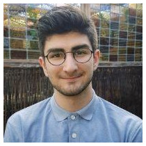



Frederik L. Johansen
---
PhD candidate in the AIChemy project. 

Julian E. Schön
---
Research Assistant working with FaunaPhotonics.

Pedram Bakhtiarifard
---
 Research Assistant working on Resource Efficient ML.

Ulrik Friis-Jensen
---
{: style="float: left"} *I am a PhD-fellow at the Department of Chemistry under the AIChemy project. I have both BSc and MSc in Nanoscience from the University of Copenhagen. I used my elective courses on the masters programme to do ML oriented math and programming courses. My work is mainly focused on using GNNs and Generative Models to do structure solution of nanoparticles from Total Scattering and Pair Distribution Function (PDF) data.*

