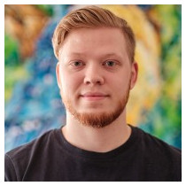
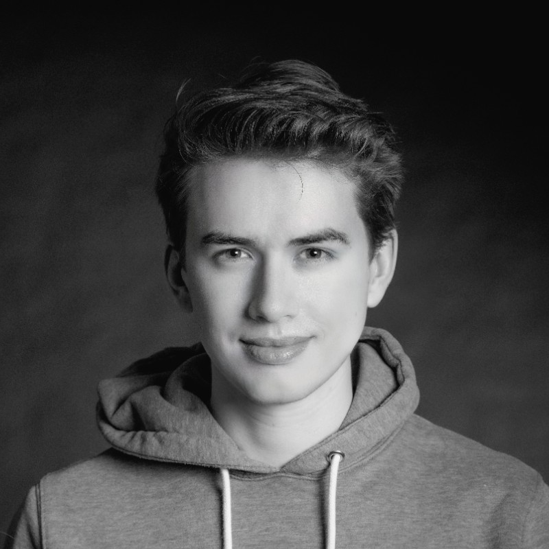



## Current Team

| **Pedram Bakhtiarifard** | (2022/10--)| In August 2022 Pedram Bakh. joined the Machine Learning section at DIKU as a research assistant to work on methods for sustainable AI and Resource Efficient ML. His primary interest lies in reducing the carbon footprint of ML tasks while maintaining similar performance statistics to current state-of-the-art methods. Pedram holds a BSc in Computer Science from DIKU and starts the MSc programme in September 2022.|[Bakhtiarifard et al. 2024](https://arxiv.org/abs/2210.06015) |
|**Frederik L. Johansen** | (2022/08--) |*Hi! My name is Frederik, and I am a PhD student in the AIChemy project. I have a BSc in Physics and Computer Science from Aarhus University and a MSc in Computational Physics from UCPH. I am mainly doing atomic structure prediction from X-ray Total Scattering and Pair Distribution Function data using Generative ML.*|[Friis-Jensen,Johansen et al.](https://arxiv.org/abs/2402.13221); [Johansen et al.](https://joss.theoj.org/papers/10.21105/joss.06024)|
| **Ulrik Friis-Jensen** | (2022/08--) | *I am a PhD-fellow in the AIChemy project. I have both BSc and MSc in Nanoscience from the University of Copenhagen. I used my elective courses on the masters programme to do ML oriented math and programming courses. My work is mainly focused on using GNNs and Generative Models to do structure solution of nanoparticles from Total Scattering and Pair Distribution Function (PDF) data.*| [Friis-Jensen,Johansen et al.](https://arxiv.org/abs/2402.13221); [Johansen et al.](https://joss.theoj.org/papers/10.21105/joss.06024)|
| **Tong Chen** | (2023/06--) | *Postdoc working on sustainable Machine Learning*| |
| **Jákup O. Svöðstein** | (2023/06--)| Double PhD candidate (jointly with University of Faroe Islands) studying Data-Driven Machine Learning Approaches for Compressible and Incompressible Fluid Dynamics Modelling.| |
| **Sebastian Eliassen** | (2023/10--) | *Research Assistant working on Low-precision Deep Learning*| |
| **Bob Pepin** | (2024/01--) | *Postdoc working on sustainable machine learning*| |
| **Rasmus Løvstad** | (2024/03--) | *Student Research Assistant working on carbon footprint aware task scheduling.*| |

## Former Team Members

| **Julian E. Schön** | (2023/01--2023/12)| Research Assistant with a focus on dataset condensation methods. Julian also worked on his MSc thesis co-supervised by RS on interpreting the latent spaces of generative models.| |
| **Dustin Wright** | (2023/02--2024/01) | *Postdoc with a focus on sustainable Machine Learning*| |

